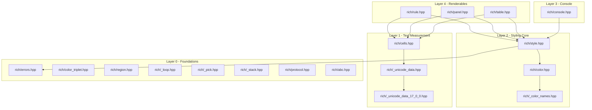

# Architecture

## Overview

`rich-cpp` is a **header-only C++17 library**. Every `.hpp` file in the [rich/](rich/) directory corresponds 1:1 to a `.py` file in the original [Textualize/rich](https://github.com/Textualize/rich) Python repository, mirroring module boundaries so the two codebases are easily cross-referenced.

There is no `.cpp` compiled library split — applications include required headers (such as `#include "rich/console.hpp"`), and the C++ compiler processes them inline. The [main.cpp](main.cpp) file is a standalone smoke test and demo application.

---

## Layered Dependency Structure

`rich-cpp` is structured in strict architectural layers. Each layer depends only on components below it, preventing circular header inclusions:



### Layer Rules
- Nothing in Layer *N* includes anything from Layer *N+1* or above.
- Clean header separation ensures zero circular dependencies.

---

## Data Flow: Processing `console.print_markup(...)`

```
"[bold red]hi[/bold red]"
        │
        ▼
┌───────────────────┐
│ rich/console.hpp  │  Scans for [tag]...[/tag] pairs, maintains a
│ print_markup()    │  style stack for nested tags.
└─────────┬─────────┘
          │  for each tag: Style::parse(tag_text)
          ▼
┌───────────────────┐
│ rich/style.hpp    │  Parses "bold red" -> sets bold=true,
│ Style::parse()    │  color=Color::parse("red").
└─────────┬─────────┘
          │  color name lookup
          ▼
┌───────────────────┐
│ rich/color.hpp    │  "red" -> ANSI_COLOR_NAMES lookup -> Color{
│ Color::parse()    │    type=STANDARD, number=1 }.
└─────────┬─────────┘
          │  style.render(text) combines attribute + color SGR codes
          ▼
┌───────────────────┐
│ rich/style.hpp    │  ansi_codes() -> "1;31" (bold=1, red fg=31)
│ Style::render()   │  render() wraps: "\x1b[1;31m" + text + "\x1b[0m"
└─────────┬─────────┘
          ▼
     std::cout  ->  Terminal Output
```

Renderable components ([table.hpp](rich/table.hpp), [panel.hpp](rich/panel.hpp), [rule.hpp](rich/rule.hpp)) calculate column and padding widths using `rich::cell_len()` from [cells.hpp](rich/cells.hpp) before writing UTF-8 box-drawing characters and styled text to `std::cout`.

---

## Terminal Cell Measurement Engine

Terminal layouts depend on **cell width** rather than raw byte count or Unicode codepoint count:
- ASCII characters: 1 cell
- CJK characters: 2 cells
- Emoji graphemes: 2 cells
- Combining characters / ZWJ sequence modifiers: 0 cells

[rich/cells.hpp](rich/cells.hpp) provides cell width lookup and grapheme splitting without depending on styling modules, matching Python Rich's `cells.py` design.

---

## Mechanically Generated Data Tables

Two headers are generated offline from Python source data:
- [rich/_unicode_data_17_0_0.hpp](rich/_unicode_data_17_0_0.hpp): 464 Unicode width ranges and 213 narrow-to-wide character mappings extracted from Python Rich's Unicode data.
- [rich/_color_names.hpp](rich/_color_names.hpp): 235 named-color to ANSI number mappings extracted from Python Rich's `ANSI_COLOR_NAMES`.

---

## String Representation Strategy

- `std::string` (UTF-8 bytes): Used at public API boundaries, style definitions, and console output.
- `std::u32string` (UTF-32, `char32_t` per codepoint): Used internally in [cells.hpp](rich/cells.hpp) for per-codepoint indexing, grapheme splitting, and text cropping.

---

## Future Extension Points

1. **Segment & Text (`rich/segment.hpp`, `rich/text.hpp`)**: Will sit between Layer 1 and Layer 3 to support word-wrapping and text justification.
2. **Box Definitions (`rich/box.hpp`)**: Will extract hard-coded box-drawing constants from `table.hpp` and `panel.hpp` into configurable `Box` styles.
