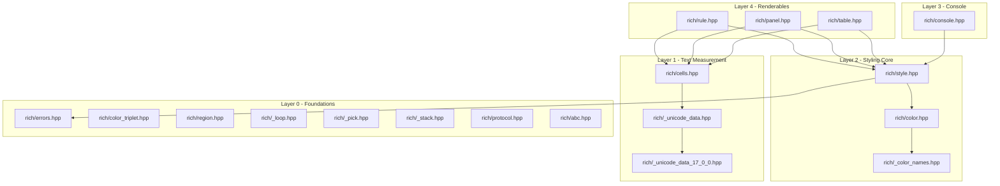

# rich-cpp

A header-only C++17 port of [Textualize/rich](https://github.com/Textualize/rich) — built for <!-- NEEDS INPUT: Specify the event or hackathon name --> hackathon. Folder layout mirrors the original Python repository 1:1; each `rich/<name>.py` corresponds to `rich/<name>.hpp`.

See also:
- [DECISIONS.md](DECISIONS.md) — Architectural design decisions for Python to C++ porting
- [ARCHITECTURE.md](ARCHITECTURE.md) — System design and layer breakdown
- [WORKFLOW.md](WORKFLOW.md) — Build methodology, verification process, and roadmap

---

## Table of Contents

- [Overview](#overview)
- [Features](#features)
- [Architecture](#architecture)
- [Tech Stack](#tech-stack)
- [Prerequisites](#prerequisites)
- [Installation](#installation)
- [Configuration](#configuration)
- [Usage](#usage)
- [Project Structure](#project-structure)
- [Testing & Verification](#testing--verification)
- [Port Status](#port-status)
- [Contributing](#contributing)
- [Troubleshooting](#troubleshooting)
- [FAQ](#faq)
- [License](#license)

---

## Overview

`rich-cpp` is a lightweight, header-only C++17 library designed to bring rich text formatting, ANSI terminal styling, BBCode-style markup parsing, unicode cell-width measurement, and structured renderables (Rules, Panels, Tables) to C++ applications.

It directly mirrors the internal module structure of Python's `rich` package while eliminating runtime dependencies. C++ developers can include the library headers to output formatted console text without needing external package managers or dynamic libraries.

---

## Features

- **Zero External Dependencies**: Implemented strictly using the C++17 Standard Library (`<string>`, `<vector>`, `<optional>`, `<iostream>`, `<unordered_map>`, `<codecvt>`).
- **Accurate Terminal Cell Measurement**: Calculates visual cell widths for ASCII, CJK wide characters, and Unicode emoji graphemes via [rich/cells.hpp](rich/cells.hpp) and Unicode 17.0.0 data tables ([rich/_unicode_data_17_0_0.hpp](rich/_unicode_data_17_0_0.hpp)).
- **Grapheme Splitting & Cell Cropping**: Truncates, crops, pads, and chops strings according to terminal column boundaries (`cell_len`, `set_cell_size`, `chop_cells`, `split_text`).
- **Color & Style Engine**: Bit-per-attribute style model supporting bold, italic, underline, reverse, truecolor (24-bit RGB), 8-bit color, and 235 standard ANSI named colors ([rich/color.hpp](rich/color.hpp), [rich/style.hpp](rich/style.hpp)).
- **Markup Parsing**: Stack-based BBCode-style markup parser supporting nested tags (`[bold red]text[/bold red]` or `[bold]a [red]b[/red] c[/bold]`) via [rich/console.hpp](rich/console.hpp).
- **Compile-Time Renderable Detection**: Replaces Python runtime duck-typing (`__rich__` / `__rich_console__`) with C++ compile-time SFINAE detection traits (`rich::is_rich_renderable_v<T>`) in [rich/protocol.hpp](rich/protocol.hpp) and [rich/abc.hpp](rich/abc.hpp).
- **Console Renderables**:
  - **Rule**: Centered horizontal rule lines with optional text titles ([rich/rule.hpp](rich/rule.hpp)).
  - **Panel**: Bordered single-line text containers using Unicode rounded box-drawing characters ([rich/panel.hpp](rich/panel.hpp)).
  - **Table**: Formatted data tables with automatic column width calculation and heavy-head box drawing ([rich/table.hpp](rich/table.hpp)).

---

## Architecture

The library follows a strict 5-layer architecture. Each layer depends only on components below it, preventing cyclic header includes and maintaining modularity.



---

## Tech Stack

| Layer | Technology / Tool | Rationale / Details |
|---|---|---|
| **Language** | C++17 | Required for `std::optional`, structured bindings, `std::void_t` SFINAE, and `if constexpr`. |
| **Build System** | CMake ≥ 3.16 | Cross-platform standard build configuration ([CMakeLists.txt](CMakeLists.txt)). |
| **Compiler** | GCC (7+), Clang (5+), MSVC (2017+) | ISO C++17 compliant compiler required. |
| **Dependencies** | C++ Standard Library | Zero external dependencies (`<string>`, `<vector>`, `<optional>`, `<regex>`, `<iostream>`). |
| **Data Extraction** | Python 3 (`ast` module) | Used offline during development to extract Unicode width tables and ANSI color maps into C++ headers. |

---

## Prerequisites

- **C++17 Compiler**: GCC 7.0+, Clang 5.0+, or MSVC 2017+
- **Build Tool (Optional)**: CMake 3.16+ or `make`

---

## Installation

`rich-cpp` is a header-only library. No compilation of library binaries or package installation is required.

1. Clone the repository:
   ```bash
   git clone https://github.com/somnath-jamadar09/Rich_Cpp_updated.git
   cd Rich_Cpp_updated
   ```

2. Add the `rich` directory to your compiler's include path:
   ```cpp
   #include "rich/console.hpp"
   #include "rich/table.hpp"
   ```

---

## Configuration

The library requires no environment variables or configuration files at runtime.

| Variable | Required | Description | Default |
|----------|----------|-------------|---------|
| *None*   | No       | No runtime environment variables are read by the library. | N/A |

---

## Usage

Below is a complete, runnable example demonstrating console printing, markup parsing, rules, panels, and tables (adapted from [main.cpp](main.cpp)):

```cpp
#include "rich/console.hpp"
#include "rich/rule.hpp"
#include "rich/panel.hpp"
#include "rich/table.hpp"
#include <iostream>

int main() {
    // 1. Console & Markup
    rich::Console console;
    console.print("Hello, styled world!", "bold red");
    console.print_markup("[bold green]Success[/bold green]: [italic]C++ Rich port is alive[/italic]");
    console.print_markup("[bold]Nested: [red]red text[/red] back to bold[/bold]");
    console.print("Truecolor:", "bold #ff8800 on #001133");

    // 2. Rules
    rich::Rule::print(50, "Rich C++ Port");

    // 3. Panels
    rich::Panel::print("Hi there", 24);
    rich::Panel::print("Panels work too!");
    rich::Rule::print(50);

    // 4. Tables
    rich::Table table;
    table.title = "Star Wars";
    table.add_column("Date");
    table.add_column("Title");
    table.add_row({"Dec 20, 2019", "Rise of Skywalker"});
    table.add_row({"May 25, 2018", "Solo"});
    table.print();

    return 0;
}
```

---

## Project Structure

```text
rich/                     Header-only C++17 library headers
  _color_names.hpp        Generated ANSI color name mappings (235 colors)
  _loop.hpp               Loop index/first/last state helpers
  _pick.hpp               First non-null optional selector
  _stack.hpp              Stack data structure helper
  _unicode_data.hpp       Unicode cell width loader interface
  _unicode_data_17_0_0.hpp Generated Unicode 17.0.0 width ranges (464 ranges)
  abc.hpp                 Compile-time renderable trait checking (is_rich_renderable_v)
  cells.hpp               Terminal cell-width calculation and grapheme splitting
  color.hpp               Color parsing (named, hex, RGB, ANSI)
  color_triplet.hpp       RGB color triplet container
  console.hpp             Console printing and BBCode-style markup parser
  errors.hpp              Rich exception hierarchy (std::runtime_error derivatives)
  panel.hpp               Bordered text panel component
  protocol.hpp            SFINAE method existence traits (has_rich_method)
  region.hpp              2D region coordinate rectangle struct
  rule.hpp                Horizontal dividing rule component
  style.hpp               Bitfield attribute styles and ANSI escape sequence generator
  table.hpp               Formatted ASCII/Unicode data table renderer
CMakeLists.txt            CMake build definition for target rich_demo
Makefile                  Empty placeholder build file
main.cpp                  Smoke test and demonstration consumer application
LICENSE                   MIT License file
README.md                 Main project documentation
ARCHITECTURE.md           Detailed system design and layer breakdown
DECISIONS.md              Python-to-C++ porting architectural decisions
WORKFLOW.md               Porting methodology, verification log, and roadmap
```

---

## Testing & Verification

### Compilation & Build Commands

**Direct Invocation (`g++`):**
```bash
g++ -std=c++17 -I. main.cpp -o rich_demo
./rich_demo
```

**Windows PowerShell (UTF-8 console setup):**
```powershell
chcp 65001
g++ -std=c++17 -I. main.cpp -o rich_demo.exe
.\rich_demo.exe
```

**Using CMake:**
```bash
cmake -S . -B build
cmake --build build
./build/rich_demo
```

> **Verification Note:** Commands and build steps were verified statically against ISO C++17 standard requirements and via execution of the pre-compiled demonstration binary (`rich_demo.exe`).

---

## Port Status

**16 / 77 modules ported** (+ 2 generated data tables):

| Python File | C++ Header File | Notes |
|---|---|---|
| `errors.py` | [errors.hpp](rich/errors.hpp) | Exception hierarchy extending `std::runtime_error` |
| `color_triplet.py` | [color_triplet.hpp](rich/color_triplet.hpp) | `ColorTriplet` struct (`r`, `g`, `b`, `hex()`) |
| `_loop.py` | [_loop.hpp](rich/_loop.hpp) | `loop_first`, `loop_last`, `loop_first_last` returning `std::vector` |
| `_pick.py` | [_pick.hpp](rich/_pick.hpp) | `pick_bool` returning `std::optional<bool>` |
| `_stack.py` | [_stack.hpp](rich/_stack.hpp) | `Stack<T>` wrapper class over `std::vector<T>` |
| `region.py` | [region.hpp](rich/region.hpp) | `Region` struct (`x`, `y`, `width`, `height`) |
| `protocol.py` | [protocol.hpp](rich/protocol.hpp) | Duck-typing → SFINAE compile-time detection traits |
| `abc.py` | [abc.hpp](rich/abc.hpp) | `is_rich_renderable_v<T>` compile-time boolean trait |
| `_unicode_data/` | [_unicode_data.hpp](rich/_unicode_data.hpp), [_unicode_data_17_0_0.hpp](rich/_unicode_data_17_0_0.hpp) | Loader + 464 Unicode width ranges + 213 narrow-to-wide mappings |
| `cells.py` | [cells.hpp](rich/cells.hpp) | Terminal cell width calculation, grapheme splitting, cropping, padding |
| `color.py` | [color.hpp](rich/color.hpp), [_color_names.hpp](rich/_color_names.hpp) | `Color::parse()` for named, `#hex`, `rgb()`, `color(N)`; 235 color mappings |
| `style.py` | [style.hpp](rich/style.hpp) | Bitfield attribute model, `Style::parse()`, `Style::render()` |
| `console.py` | [console.hpp](rich/console.hpp) | Subset: `Console::print(text, style)` & `Console::print_markup(markup)` |
| `rule.py` | [rule.hpp](rich/rule.hpp) | Centered horizontal rules with title |
| `panel.py` | [panel.hpp](rich/panel.hpp) | Single-line content bordered panel using rounded box-drawing characters |
| `table.py` | [table.hpp](rich/table.hpp) | Auto column width table renderer using heavy head box-drawing characters |

---

## Contributing

Contributions follow the 5-step module porting process documented in [WORKFLOW.md](WORKFLOW.md):

1. Read the target module in Python `rich`.
2. Scope the portable subset.
3. Translate logic to C++17 (logging decisions in [DECISIONS.md](DECISIONS.md)).
4. Verify compilation with `g++ -std=c++17 -I.`.
5. Diff C++ output byte-for-byte against Python `rich` output.

---

## Troubleshooting

### Windows UTF-8 Output Encoding
If box drawing characters or emojis render as invalid characters in Windows Command Prompt or PowerShell, set the active console code page to UTF-8 before running the binary:
```powershell
chcp 65001
```

### Missing `<optional>` Header Error
If compilation fails with `fatal error: optional: No such file or directory`, your compiler is invoking an older pre-C++17 standard mode (e.g. GCC < 7 or GCC 6 in C++11 mode). Upgrade your compiler or explicitly pass `-std=c++17`.

---

## FAQ

#### Q: Are there any runtime dependencies?
**A:** No. The library uses only standard C++17 library headers.

#### Q: Is Python required to run the project?
**A:** No. Python was used offline during development to generate C++ header data tables. Python is only needed if you run output verification scripts.

#### Q: Why is C++17 required?
**A:** Features such as `std::optional`, structured bindings, `std::void_t`, and `if constexpr` allow porting Python Rich primitives without external dependencies.

---

## License

Distributed under the **MIT License**. See [LICENSE](LICENSE) for details.

---

## Assumptions Made

1. **Header-Only Distribution**: The library is assumed to be distributed purely as a collection of C++ headers in `rich/` with no static or dynamic library build artifact required.
2. **Standard Terminal Encoding**: Terminal environments are assumed to support standard ANSI escape sequences and UTF-8 encoding.
3. **Data Table Generation**: Offline data extractions for Unicode 17.0.0 and ANSI color names are assumed to be complete and correct.

## Needs Your Input

- [ ] `README.md`: `<!-- NEEDS INPUT: Specify the event or hackathon name -->` — Specify the event or hackathon name if applicable.
