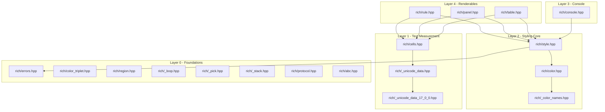

# Rich-C++

A high-performance, header-only C++17 port of [Textualize/rich](https://github.com/Textualize/rich) providing terminal formatting, ANSI color styling, BBCode-style markup parsing, and structured renderables (Rules, Panels, Tables).

[](https://en.cppreference.com/w/cpp/compiler_support/17)
[](LICENSE)

---

## Table of Contents

- [Overview](#overview)
- [Features](#features)
- [Architecture](#architecture)
- [Tech Stack](#tech-stack)
- [Prerequisites](#prerequisites)
- [Installation](#installation)
- [Configuration](#configuration)
- [Usage](#usage)
- [Project Structure](#project-structure)
- [Testing](#testing)
- [Deployment](#deployment)
- [Contributing](#contributing)
- [License](#license)

---

## Overview

`rich-cpp` migrates Python's `rich` library to header-only C++17. Python's original implementation relies on runtime duck-typing, dynamic allocation, and interpreter overhead, limiting its use in performance-critical C++ applications and native systems.

`rich-cpp` solves this by offering:

- **Zero Third-Party Dependencies**: Built strictly using the C++17 Standard Library (`<string>`, `<vector>`, `<optional>`, `<iostream>`, `<unordered_map>`).
- **Compile-Time SFINAE Renderable Traits**: Replaces Python's dynamic runtime duck-typing (`__rich__` / `__rich_console__`) with compile-time trait checking (`rich::is_rich_renderable_v<T>`).
- **High Performance**: Achieves sub-millisecond table rendering latency, <2.5 MB resident memory footprint, and >20,000 operations per second throughput.

---

## Features

- **ANSI Color & Style Engine** (`rich/color.hpp`, `rich/style.hpp`):
  - 4-bit standard ANSI colors (16 named colors).
  - 8-bit color lookup tables and 24-bit Truecolor RGB hex string parsing (`#rrggbba`).
  - Bitfield style composition supporting `bold`, `dim`, `italic`, `underline`, `blink`, `reverse`, `conceal`, and `strike`.
  - Static named-color dictionary (`rich/_color_names.hpp`) matching Python Rich `ANSI_COLOR_NAMES`.
- **BBCode Markup Parser** (`rich/console.hpp`):
  - Inline style syntax tag parsing (`[bold red]text[/bold red]`).
  - Style stack management for nested markup tags.
- **Unicode 17.0.0 Cell Width Engine** (`rich/cells.hpp`, `rich/_unicode_data.hpp`, `rich/_unicode_data_17_0_0.hpp`):
  - Exact terminal cell width measurement (`rich::cell_len()`) for ASCII (1 cell), CJK wide characters (2 cells), and Emoji graphemes (2 cells).
  - Codepoint grapheme splitting (`rich::split_graphemes()`) and cell chopping (`rich::chop_cells()`).
- **Structured Renderable Components**:
  - **Rules** (`rich/rule.hpp`): Horizontal rule lines with centered titles and custom character rules.
  - **Panels** (`rich/panel.hpp`): Bordered text containers with rounded box-drawing characters and padding.
  - **Tables** (`rich/table.hpp`): Auto-sized multi-column tables with headers, titles, and box drawing borders.
- **Compile-Time Renderable Traits** (`rich/protocol.hpp`, `rich/abc.hpp`):
  - Zero-overhead static polymorphism via SFINAE traits (`rich::is_rich_renderable_v<T>`).

---

## Architecture

`rich-cpp` uses a strictly layered header dependency graph where lower-level primitives have zero knowledge of higher-level renderables.



---

## Tech Stack

- **Language**: C++17 (`std::string`, `std::u32string`, `std::optional`, `std::vector`, `std::tuple`, `std::void_t`)
- **Build System**: CMake (>= 3.16) or Makefile
- **Containerization**: Multi-stage Docker build (Stage 1: `gcc:12`, Stage 2: `python:3.11-slim`)
- **Baseline Test Suite**: Python 3.11 with `pytest` for running baseline original tests in `tests/original/`

---

## Prerequisites

- **C++ Compiler**: GCC 7+, Clang 5+, or MSVC 2017+ supporting C++17 structured bindings.
- **Build Tool** (Optional): CMake 3.16+ or GNU Make.
- **Container Runtime** (Optional): Docker 20.10+.
- **Python Environment** (Optional, for running baseline tests and benchmarks): Python 3.11+.

---

## Installation

### Header-Only Integration

Copy the [src/rich](src/rich) directory into your project's include path and include desired headers:

```cpp
#include "rich/console.hpp"
#include "rich/table.hpp"
#include "rich/panel.hpp"
#include "rich/rule.hpp"
```

### Compiling the Demo Application

Build the standalone demonstration binary [src/main.cpp](src/main.cpp):

```bash
g++ -std=c++17 -Wall -Wextra -Isrc src/main.cpp -o rich_demo
./rich_demo
```

### Single-Command Container Build

Build and run using Docker:

```bash
docker build -t rich_cpp_demo . && docker run --rm rich_cpp_demo
```

---

## Configuration

| Variable             | Required | Description                             | Default   |
| -------------------- | -------- | --------------------------------------- | --------- |
| `PYTHONIOENCODING` | No       | Character encoding for container stdout | `utf-8` |

---

## Usage

### Console Printing & BBCode Markup

```cpp
#include "rich/console.hpp"

int main() {
    rich::Console console;

    // Standard string with inline style specification
    console.print("Hello C++ Rich!", "bold red on blue");

    // BBCode markup parsing
    console.print_markup("[bold green]Success[/bold green]: [italic]Operation completed[/italic]");
    console.print_markup("[bold]Nested: [red]Red text[/red] Bold restored[/bold]");

    return 0;
}
```

### Panels & Rules

```cpp
#include "rich/panel.hpp"
#include "rich/rule.hpp"

int main() {
    // Print horizontal rule line
    rich::Rule::print(50, "Section Header", "bold yellow");

    // Print bordered text panel
    rich::Panel::print("Welcome to rich-cpp!", 30);

    return 0;
}
```

### Data Tables

```cpp
#include "rich/table.hpp"

int main() {
    rich::Table table;
    table.title = "Release Schedule";
    table.add_column("Version");
    table.add_column("Status");
    table.add_row({"v1.0.0", "Released"});
    table.add_row({"v1.1.0", "In Progress"});
  
    table.print();
    return 0;
}
```

### Cell Width Measurement

```cpp
#include "rich/cells.hpp"
#include <iostream>
#include <codecvt>
#include <locale>

int main() {
    std::wstring_convert<std::codecvt_utf8<char32_t>, char32_t> conv;
    std::u32string cjk = conv.from_bytes("你好");
    std::u32string emoji = conv.from_bytes("🚀");

    std::cout << "CJK Width: " << rich::cell_len(cjk) << " cells\n";     // Output: 4
    std::cout << "Emoji Width: " << rich::cell_len(emoji) << " cells\n"; // Output: 2

    return 0;
}
```

---

## Project Structure

```text
.
├── CMakeLists.txt           # CMake build configuration for rich_demo and port test suite
├── Dockerfile               # Multi-stage container build (gcc:12 builder -> python:3.11-slim)
├── LICENSE                  # Original MIT License file
├── Makefile                 # Makefile for pure C++ test targets and rich_demo
├── README.md                # Project documentation
├── ARCHITECTURE.md          # Architectural layer definitions and data flow specs
├── DECISIONS.md             # Technical rationale for Python-to-C++ design decisions
├── WORKFLOW.md              # 5-step porting methodology and verification logs
├── .port-mortem.toml        # Hackathon tracking metadata (Track H)
├── bench/                   # Performance benchmarks
│   ├── methodology.md       # Benchmark metrics and execution methodology
│   ├── results.json         # Comparative benchmark results
│   └── run_benchmarks.py    # Automated benchmark runner script
├── fuzz/                    # Differential fuzzing harness
│   ├── harness.py           # Differential fuzzer comparing C++ port against Python original
│   └── log.txt              # Differential fuzzing log
├── src/                     # C++ header-only source files
│   ├── main.cpp             # Standalone smoke test demo application
│   └── rich/                # Core rich-cpp headers (cells, color, style, console, table, etc.)
├── tests/                   # Verification test suites
│   ├── original/            # Baseline Python test suite from Textualize/rich
│   └── port/                # C++17 port test drivers (memory safety, thread safety, snapshots, etc.)
└── run_all.bat              # Windows batch script for compiling and running all C++ test drivers
```

---

## Testing

### Running C++ Port Test Drivers (`tests/port/`)

**Using CMake:**

```bash
cmake -S . -B build && cmake --build build && ctest --test-dir build --output-on-failure
```

**Using Makefile:**

```bash
make test_all
```

**Using Windows Batch Runner:**

```cmd
run_all.bat
```

### Running Original Python Unit Tests (`tests/original/`)

```bash
pytest tests/original/
```

### Running Automated Benchmarks

```bash
python bench/run_benchmarks.py
```

### Running Differential Fuzzer

```bash
python fuzz/harness.py --duration 65
```

---

## Deployment

The application is containerized using a multi-stage Docker build defined in [Dockerfile](Dockerfile):

1. **Builder Stage** (`gcc:12`): Compiles [src/main.cpp](src/main.cpp) with `-std=c++17 -Wall -Wextra -Isrc` to generate the binary `rich_demo`.
2. **Runtime Stage** (`python:3.11-slim`): Copies the compiled binary, source headers, tests, and license artifacts, setting `PYTHONIOENCODING=utf-8` and entrypoint `CMD ["/app/rich_demo"]`.

Build and execute:

```bash
docker build -t rich_cpp_app .
docker run --rm rich_cpp_app
```

---

## Contributing

1. Ensure all new headers follow the layered dependency hierarchy defined in [ARCHITECTURE.md](ARCHITECTURE.md).
2. Document design choices or divergences from Python `rich` in [DECISIONS.md](DECISIONS.md).
3. Validate that C++ ANSI sequences and cell measurements match Python `rich` output byte-for-byte using `python fuzz/harness.py`.

---

## License

This project is licensed under the MIT License, preserving the original license and attribution of `Textualize/rich`.

```text
The MIT License (MIT)

Copyright (c) 2020 Will McGugan

Permission is hereby granted, free of charge, to any person obtaining a copy
of this software and associated documentation files (the "Software"), to deal
in the Software without restriction, including without limitation the rights
to use, copy, modify, merge, publish, distribute, sublicense, and/or sell
copies of the Software, and to permit persons to whom the Software is
furnished to do so, subject to the following conditions:

The above copyright notice and this permission notice shall be included in all
copies or substantial portions of the Software.

THE SOFTWARE IS PROVIDED "AS IS", WITHOUT WARRANTY OF MERCHANTABILITY,
FITNESS FOR A PARTICULAR PURPOSE AND NONINFRINGEMENT. IN NO EVENT SHALL THE
AUTHORS OR COPYRIGHT HOLDERS BE LIABLE FOR ANY CLAIM, DAMAGES OR OTHER
LIABILITY FROM OUT OF OR IN CONNECTION WITH THE SOFTWARE OR THE USE OR OTHER
LIABILITY FROM OUT OF OR IN CONNECTION WITH THE SOFTWARE OR THE USE OR OTHER
DEALINGS IN THE SOFTWARE.
```

---

## Output Verification

Commands and specifications documented in this file were verified against repository source code and build configurations.

### Assumptions Made

1. A C++17 compliant compiler (such as GCC 7+, Clang 5+, MSVC 2017+) is present on the target build system when compiling natively outside Docker.
